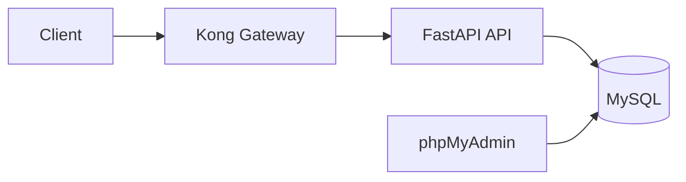
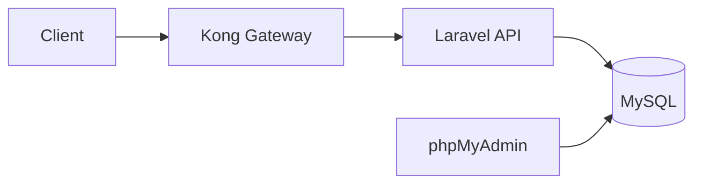
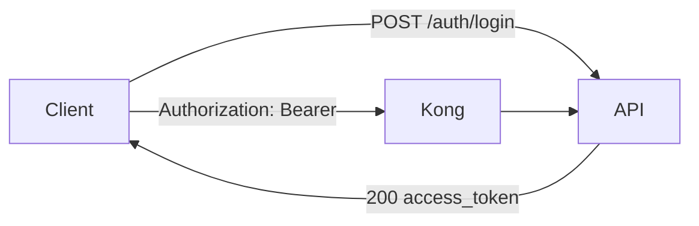

# API Gateway Testing (FastAPI + Kong, Laravel + Kong)

This repository has two complete implementations of the same API stack:
- FastAPI + Kong: https://github.com/niketchandra/api-gateway-testing/tree/FastAPI-with-Kong
- Laravel + Kong: https://github.com/niketchandra/api-gateway-testing/tree/Laravel-with-Kong

Each branch contains a full Docker setup with MySQL, phpMyAdmin, and Kong in DB-less mode.

## Architecture and flow

### FastAPI + Kong (request flow)


### Laravel + Kong (request flow)


### Auth flow (JWT/Bearer)


## Why JWT helps
- Stateless authentication: the API verifies the token signature without server-side sessions.
- Scales easily behind Kong because any API instance can validate the same token.
- Tokens carry claims (like user id) and an expiry time, reducing DB lookups.
- The client only sends an Authorization header after login.

## Running the stacks (Docker)
Use the compose files in each branch root.

Start API + MySQL + phpMyAdmin:
```bash
docker compose up -d
```

Start API + MySQL + phpMyAdmin + Kong:
```bash
docker compose -f docker-compose.yml -f docker-compose-kong.yml up -d
```

Endpoints (both branches):
- API (direct): http://localhost:8000
- Kong proxy: http://localhost:8002
- Kong admin: http://localhost:8001
- phpMyAdmin: http://localhost:8080

## API surface (both branches)
The FastAPI and Laravel branches implement the same core APIs so Kong can route the same paths:
- Users CRUD: /users (GET, POST, PUT, DELETE) and /users/{id}
- Auth: /auth/login, /auth/logout
- Products CRUD (if enabled): /products (GET, POST, PUT, DELETE) and /products/{id}
- Files (if enabled): /files/upload (POST), /files/{fileId} (GET)

## Developer workflow (new API)
1. Create your API (models, controllers, routes, migrations) in the chosen branch.
2. Run migrations in the API container.
3. Add the new routes to kong/kong.yml.
4. Restart Kong so it reloads the declarative config.

## Troubleshooting
- Kong says "no Route matched": Kong did not reload the latest kong.yml.
- 500 errors after schema changes: run migrations.
- Docker network errors: bring the stack down and up again.

If you want this README to include concrete curl examples for each branch, tell me which branch to target first.