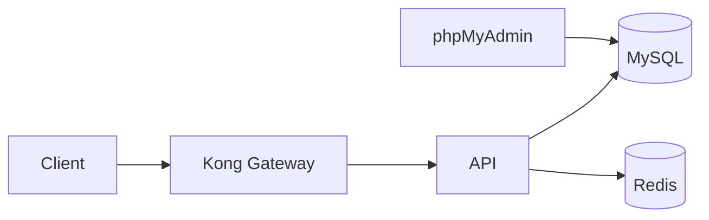
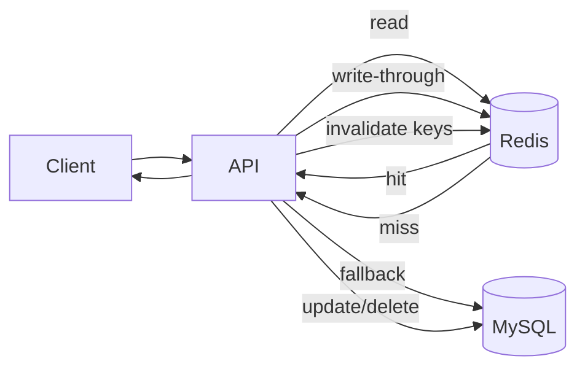

# Redis guide (future)

This document explains how to add Redis to the FastAPI and Laravel branches and how Redis can support users, products, and files.

## Why Redis
- Cache hot reads (user profiles, product listings).
- Store short-lived session or token data.
- Track rate limits or request counters.
- Store temporary file metadata (file_id -> path, ttl).

## Architecture (with Redis)


## Common usage patterns
- Users:
  - Cache user lookups by id and email.
  - Invalidate cache on update/delete.
- Products:
  - Cache product list and product details.
  - Invalidate cache when products change.
- Files:
  - Store file metadata (file_id -> storage path) with a ttl.
  - Use Redis to expire metadata automatically.

## Docker Compose updates (both branches)
Add a Redis service in docker-compose.yml:

```yaml
services:
  redis:
    image: redis:7
    ports:
      - "6379:6379"
```

If the API uses Redis, add these env vars (example):

```yaml
services:
  api:
    environment:
      REDIS_HOST: redis
      REDIS_PORT: 6379
```

## FastAPI branch changes
1. Install Redis client:
   - Add to requirements.txt: redis
2. Create a Redis client in the app (single instance or dependency).
3. Cache user/product queries; invalidate on write.
4. Optionally use Redis for token revocation or rate limiting.

Example idea (pseudo flow):
- GET /users/{id} -> check Redis -> fallback to MySQL -> write to Redis.
- PUT /users/{id} -> update MySQL -> delete Redis key.

## Laravel branch changes
1. Install Redis support:
   - Option A: php-redis extension (preferred).
   - Option B: predis/predis package.
2. Set config in .env:
   - CACHE_DRIVER=redis
   - QUEUE_CONNECTION=redis (optional)
   - SESSION_DRIVER=redis (optional)
3. Use Cache facade for users/products.
4. Store file metadata in Redis with a ttl.

Example idea (Laravel cache):
- Cache::remember("user:{id}", 60, fn() => User::find($id))
- Cache::forget("user:{id}") after update/delete

## Dockerfile updates (branch-specific)
FastAPI Dockerfile:
- Add redis client dependency:
  - requirements.txt: redis

Laravel Dockerfile:
- Install php-redis extension (example snippet):

```dockerfile
RUN pecl install redis \
    ; docker-php-ext-enable redis
```

## Workflow (how it works)


1. Client requests a resource.
2. API checks Redis cache.
3. If hit, return cached data.
4. If miss, query MySQL and store in Redis with a ttl.
5. On updates/deletes, invalidate relevant keys.

This keeps hot data fast and reduces database load while keeping data consistent.

## Detailed examples (code to add)
Below are concrete examples for read APIs. These are meant to be applied in each branch.

### User read (FastAPI branch)
Files to update:
- src/app/db.py (add Redis client)
- src/app/crud.py (wrap reads)

Add Redis client in src/app/db.py:

```python
import os
import redis

REDIS_HOST = os.getenv("REDIS_HOST", "redis")
REDIS_PORT = int(os.getenv("REDIS_PORT", "6379"))

redis_client = redis.Redis(host=REDIS_HOST, port=REDIS_PORT, decode_responses=True)
```

Update read in src/app/crud.py:

```python
from .db import redis_client

def get_user(db: Session, user_id: int) -> models.User | None:
  cache_key = f"user:{user_id}"
  cached = redis_client.get(cache_key)
  if cached:
    return models.User(**json.loads(cached))

  user = db.query(models.User).filter(models.User.id == user_id).first()
  if user:
    redis_client.setex(cache_key, 60, json.dumps({
      "id": user.id,
      "name": user.name,
      "email": user.email,
      "created_at": user.created_at.isoformat(),
      "updated_at": user.updated_at.isoformat(),
    }))
  return user
```

Invalidate on update/delete in src/app/crud.py:

```python
redis_client.delete(f"user:{user.id}")
```

### User read (Laravel branch)
Files to update:
- composer/app/Http/Controllers/Api/UserController.php
- composer/.env (set CACHE_DRIVER=redis)

In UserController.php:

```php
use Illuminate\Support\Facades\Cache;

public function show(User $user)
{
  return Cache::remember("user:" . $user->id, 60, function () use ($user) {
    return $user->fresh();
  });
}
```

Invalidate on update/delete:

```php
Cache::forget("user:" . $user->id);
```

### Product read (FastAPI branch)
Files to update:
- src/app/crud.py

```python
def get_product(db: Session, product_id: int) -> models.Product | None:
  cache_key = f"product:{product_id}"
  cached = redis_client.get(cache_key)
  if cached:
    return models.Product(**json.loads(cached))

  product = db.query(models.Product).filter(models.Product.id == product_id).first()
  if product:
    redis_client.setex(cache_key, 60, json.dumps({
      "id": product.id,
      "name": product.name,
      "sku": product.sku,
      "price_cents": product.price_cents,
    }))
  return product
```

Invalidate on update/delete:

```python
redis_client.delete(f"product:{product.id}")
```

### Product read (Laravel branch)
Files to update:
- composer/app/Http/Controllers/Api/ProductController.php

```php
use Illuminate\Support\Facades\Cache;

public function show(Product $product)
{
  return Cache::remember("product:" . $product->id, 60, function () use ($product) {
    return $product->fresh();
  });
}
```

Invalidate on update/delete:

```php
Cache::forget("product:" . $product->id);
```

### File read (FastAPI branch)
Files to update:
- src/app/main.py (download endpoint)

```python
cache_key = f"file:{file_id}"
cached_path = redis_client.get(cache_key)
if cached_path:
  return FileResponse(cached_path)

# After locating file path on disk:
redis_client.setex(cache_key, 3600, file_path)
```

### File read (Laravel branch)
Files to update:
- composer/app/Http/Controllers/Api/FileController.php

```php
use Illuminate\Support\Facades\Cache;

$cacheKey = "file:" . $fileId;
$path = Cache::get($cacheKey);
if ($path && Storage::disk('local')->exists($path)) {
  return Storage::disk('local')->download($path);
}

// After resolving the file:
Cache::put($cacheKey, $match, 3600);
```

## Redis configuration checklist
- Docker: ensure redis service is running and exposed on port 6379.
- API env vars:
  - REDIS_HOST=redis
  - REDIS_PORT=6379
- Laravel .env:
  - CACHE_DRIVER=redis
  - SESSION_DRIVER=redis (optional)
  - QUEUE_CONNECTION=redis (optional)
- FastAPI requirements:
  - redis
