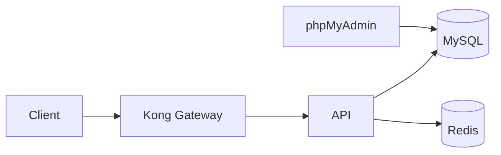
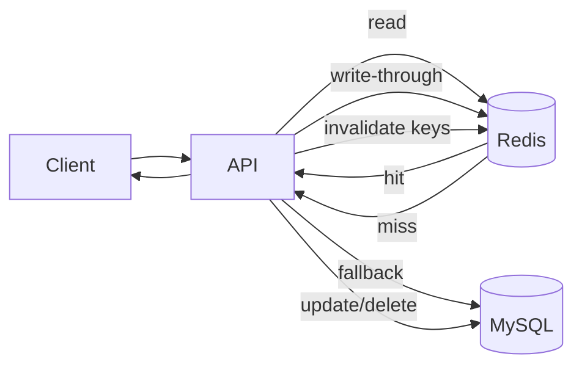

# Redis guide (future)

This document explains how to add Redis to the FastAPI and Laravel branches and how Redis can support users, products, and files.

## Why Redis
- Cache hot reads (user profiles, product listings).
- Store short-lived session or token data.
- Track rate limits or request counters.
- Store temporary file metadata (file_id -> path, ttl).

## Architecture (with Redis)


## Common usage patterns
- Users:
  - Cache user lookups by id and email.
  - Invalidate cache on update/delete.
- Products:
  - Cache product list and product details.
  - Invalidate cache when products change.
- Files:
  - Store file metadata (file_id -> storage path) with a ttl.
  - Use Redis to expire metadata automatically.

## Docker Compose updates (both branches)
Add a Redis service in docker-compose.yml:

```yaml
services:
  redis:
    image: redis:7
    ports:
      - "6379:6379"
```

If the API uses Redis, add these env vars (example):

```yaml
services:
  api:
    environment:
      REDIS_HOST: redis
      REDIS_PORT: 6379
```

## FastAPI branch changes
1. Install Redis client:
   - Add to requirements.txt: redis
2. Create a Redis client in the app (single instance or dependency).
3. Cache user/product queries; invalidate on write.
4. Optionally use Redis for token revocation or rate limiting.

Example idea (pseudo flow):
- GET /users/{id} -> check Redis -> fallback to MySQL -> write to Redis.
- PUT /users/{id} -> update MySQL -> delete Redis key.

## Laravel branch changes
1. Install Redis support:
   - Option A: php-redis extension (preferred).
   - Option B: predis/predis package.
2. Set config in .env:
   - CACHE_DRIVER=redis
   - QUEUE_CONNECTION=redis (optional)
   - SESSION_DRIVER=redis (optional)
3. Use Cache facade for users/products.
4. Store file metadata in Redis with a ttl.

Example idea (Laravel cache):
- Cache::remember("user:{id}", 60, fn() => User::find($id))
- Cache::forget("user:{id}") after update/delete

## Dockerfile updates (branch-specific)
FastAPI Dockerfile:
- Add redis client dependency:
  - requirements.txt: redis

Laravel Dockerfile:
- Install php-redis extension (example snippet):

```dockerfile
RUN pecl install redis \
    ; docker-php-ext-enable redis
```

## Workflow (how it works)


1. Client requests a resource.
2. API checks Redis cache.
3. If hit, return cached data.
4. If miss, query MySQL and store in Redis with a ttl.
5. On updates/deletes, invalidate relevant keys.

This keeps hot data fast and reduces database load while keeping data consistent.
